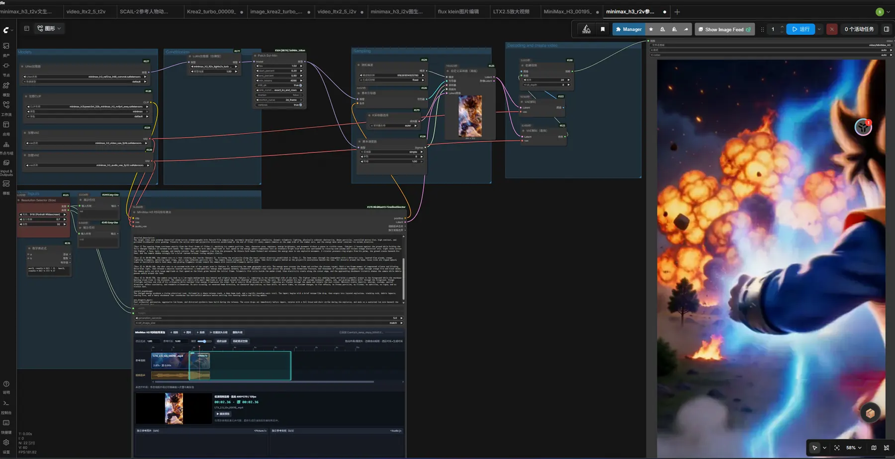
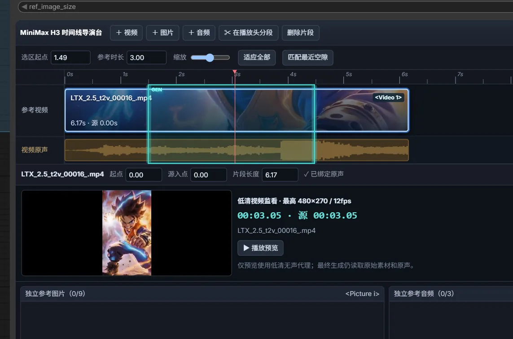

# ComfyUI MiniMax H3 Timeline Director

<p align="center">
  
</p>

<p align="center">
  Creator: <strong>Xiao Huanggua</strong><br>
  <a href="https://space.bilibili.com/219572544?spm_id_from=333.40164.0.0">Bilibili</a>
  ·
  <a href="https://www.youtube.com/@shixiongsong">YouTube</a>
</p>

[简体中文](README_CN.md) · English

An editable reference-media timeline for ComfyUI's native **MiniMax H3 Reference to Video** pipeline.

Instead of preparing every reference video, soundtrack, fixed guide, image, and audio clip in separate nodes, the Timeline Director brings them into one visual editing surface. Place and trim video clips, scrub a low-resolution preview, define the cyan generation range, and let the node assemble the exact H3 references and guides at queue time.

> This project is designed for a recent ComfyUI build that includes the native `MiniMaxH3ReferenceToVideo` implementation.



## Why this node exists

Reference-to-video workflows become difficult to manage when they contain several source clips, cropped time ranges, paired soundtracks, standalone references, and first/last-frame context. The Timeline Director turns that graph-level preparation into a familiar timeline:

- video clips live on an editable video track;
- each video's original soundtrack stays bound to the clip;
- the cyan region defines the generation/reference interval;
- the red playhead drives a low-resolution preview;
- reference images and standalone audio live in separate bins;
- H3 tags and media inputs are assembled automatically;
- two merged audio tracks are exposed as regular ComfyUI `AUDIO` outputs.

## Highlights

- **Editable multi-clip timeline** — move, trim, split, delete, and precisely position video clips.
- **Bound video soundtracks** — original audio follows every move, trim, and split operation.
- **Optional video-audio reference** — disable all paired video soundtracks while keeping the selected reference videos active.
- **Native fixed guides** — video content overlapping the cyan range is anchored at its exact generated-frame position through ComfyUI's `MiniMaxH3AddGuide`.
- **Per-clip reference purpose** — choose `Fixed Guide`, `Editable Reference`, or `Boundary Only` independently for every video clip.
- **Character-replacement mode** — `Editable Reference` sends the overlap as `<Video N>` without hard-locking the original person's latent frames.
- **Context references** — portions of a crossing clip outside the cyan range remain ordinary prompt-addressable `<Video N>` references.
- **Native gap bridging** — a range placed between clips anchors the left final frame and right first frame as generated first/last-frame guides.
- **One-click gap matching** — fit the cyan range exactly to the nearest gap.
- **Edge snapping** — clips, trim handles, the cyan range, and the red playhead snap to nearby edges.
- **Low-resolution monitoring** — cached, silent proxies up to `480×270` at `12 fps` make scrubbing responsive even with large sources.
- **Resolution protection** — reference frames are resized during decoding to the node's `width × height` before they can accumulate as full-resolution tensors.
- **Stable independent numbering** — standalone images always begin at `<Picture 1>` and standalone audio always begins at `<Audio 1>`.
- **Merged audio outputs** — output the edited video soundtrack layout and concatenated standalone reference audio.
- **Chunked uploads** — large media files are uploaded in chunks to avoid ordinary request-size limits.
- **Workflow persistence** — timeline edits are serialized into the ComfyUI workflow JSON.

## Requirements

- A recent ComfyUI version containing `MiniMaxH3AddGuide` (ComfyUI PR #15439) and the native MiniMax H3 nodes.
- MiniMax H3 Ref2VA-compatible diffusion model, text encoder, video VAE, and audio VAE.
- Python 3.10 or newer, as required by the package metadata.
- FFmpeg available through ComfyUI's bundled `imageio-ffmpeg` package for preview-proxy creation.

The plugin declares no additional pip dependencies. It uses libraries normally bundled with a compatible ComfyUI installation: PyAV, Pillow, NumPy, PyTorch, torchaudio, aiohttp, and imageio-ffmpeg.

## Installation

### Manual installation

1. Clone the repository into ComfyUI's `custom_nodes` directory:

   ```bash
   cd ComfyUI/custom_nodes
   git clone https://github.com/Songssx/ComfyUI-MiniMaxH3-TimelineDirector.git
   ```

2. Restart ComfyUI.
3. Search for **MiniMax H3 Timeline Director** or **MiniMax H3 时间线导演台**.

## Quick start

1. Add **MiniMax H3 Timeline Director** to an H3 Ref2VA workflow.
2. Connect the MiniMax H3 text encoder/CLIP to `clip`.
3. Connect the H3 video VAE to `vae`.
4. Connect the H3 audio VAE to `audio_vae`.
5. Enter or connect the generation prompt.
6. Set `width`, `height`, and `generation_seconds`.
7. Use **+ Video**, **+ Image**, and **+ Audio** to add references.
8. Move and trim video clips, then place the cyan generation range over the desired interval.
9. Use the red playhead and preview monitor to inspect the source content.
10. Connect `positive` and `LATENT` to the normal guider/sampler chain and queue the workflow.

An adapted workflow is included at:

```text
example_workflows/minimax_h3_r2v_时间线导演台.json
```

## Interface guide

### Toolbar

| Control | Function |
| --- | --- |
| `+ Video` | Upload a video and add it to the timeline. Embedded audio is detected automatically. |
| `+ Image` | Add a standalone reference image. |
| `+ Audio` | Add a standalone reference audio file. |
| `Split at Playhead` | Split the selected video clip at the red playhead. |
| `Delete Clip` | Remove the selected timeline clip. |
| `Fit All` | Adjust timeline zoom so all clips and the generation range are visible. |
| `Match Nearest Gap` | Make the cyan range exactly fill the nearest gap between video clips. |

Double-clicking an empty timeline gap also matches the cyan range to that gap.

### Timeline tracks

- **Reference Video** — draggable and trimmable video clips.
- **Video Original Audio** — waveform previews bound to their video clips. Use the adjacent **Close/Open** button to exclude or restore paired video audio in H3 reference encoding.
- **Cyan range (`GEN`)** — the interval used to prepare H3 references and the generation duration.
- **Red playhead** — the current monitoring/split position; click or drag it continuously.
- **Yellow snap guide** — appears when an edge or playhead snaps to another timeline boundary.

### Precision inspector

Select a video clip to edit its timeline start, source in-point, clip duration, original-audio binding state, and video purpose:

- **Fixed Guide**: hard-anchor every overlapping frame; best for exact continuation and preservation.
- **Editable Reference**: use the overlap as `<Video N>` without a guide; best for character, clothing, and style replacement.
- **Boundary Only**: use the overlap as `<Video N>` and anchor only its first/last frames; useful for transitions, but those two source frames remain fixed.

Existing workflows default to **Fixed Guide** for backward compatibility.

### Low-resolution preview

When the red playhead is over a video clip, the monitor displays the corresponding source frame. Press **Play Preview** to play the proxy and move the red playhead in sync.

The first preview request creates a cached proxy with these limits:

- maximum size: `480×270`;
- frame rate: `12 fps`;
- audio: disabled;
- purpose: preview only.

Final H3 conditioning always uses the original source video. Its original soundtrack is included only while the **Video Original Audio** reference switch is enabled.

### Independent reference bins

- Standalone images are shown as `<Picture 1>`, `<Picture 2>`, and so on.
- Standalone audio is shown as `<Audio 1>`, `<Audio 2>`, and so on.
- Removing an item immediately compacts the numbering.
- Clearing a bin and uploading again restarts its numbering from 1.

## Node inputs

| Input | Type | Description |
| --- | --- | --- |
| `clip` | `CLIP` | MiniMax H3-compatible text encoder/CLIP. |
| `vae` | `VAE` | MiniMax H3 video VAE used for images and video references. |
| `audio_vae` | `VAE` | MiniMax H3 audio VAE used for paired and standalone audio references. |
| `prompt` | `STRING` | H3 prompt. Use the visible `<Picture i>`, `<Video k>`, and `<Audio j>` labels. |
| `width` | `INT` | Output width and reference-media protection target. |
| `height` | `INT` | Output height and reference-media protection target. |
| `generation_seconds` | `FLOAT` | Generation duration, synchronized with the cyan range length. |
| `ref_image_size` | `COMBO` | H3 reference-image sizing policy (`match` or `max`). |
| `timeline_data` | `STRING` | Hidden serialized timeline state stored in the workflow. |

## Node outputs

| Output | Type | Description |
| --- | --- | --- |
| `positive` | `CONDITIONING` | MiniMax H3 reference-aware positive conditioning. |
| `LATENT` | `LATENT` | Empty MiniMax H3 audio/video latent aligned to the requested duration. |
| `Video Soundtrack Mix` / `视频原声合并` | `AUDIO` | Edited video soundtracks placed at timeline positions. Gaps remain silent; overlaps are mixed. |
| `Standalone Audio Merge` / `独立音频合并` | `AUDIO` | Standalone reference audios concatenated in bin order. |

If no usable audio exists, the output remains a valid silent ComfyUI `AUDIO` value. A video-only timeline produces silence matching the timeline length.

## How the cyan range becomes H3 references

### Edge overlap with a video

The source portion inside the cyan range becomes a native fixed guide at the same generated-frame offset. The source portion outside the range becomes an ordinary `<Video N>` reference. When video-audio reference is enabled, each part keeps its matching soundtrack role.

Example: a 10-second clip occupies `0–10s`, while the cyan range is `2–7s`.



- source `2–7s` is fixed inside the generated video by a native guide;
- source `0–2s` and `7–10s` become context video references (up to H3's three-video limit);
- no automatic guide consumes a `<Picture N>` ordinal.

The video-audio switch affects H3 reference conditioning only. The `Video Soundtrack Mix` output remains available for downstream workflow use.

### Selection contains the whole video

The overlapping clip is fixed at its timeline-relative frame position. A multi-frame H3 guide must have `5 + 17n` frames, so the director chains legal `5, 22, 39…`-frame batches plus single-frame guides instead of dropping the remainder. A one-second 24-frame overlap is therefore fixed completely as `22 + 1 + 1` frames.

### Empty gap between clips

If the cyan range is entirely inside an empty gap:

- no fake blank video reference is created;
- the left clip's final frame is anchored at generated frame `0`;
- the right clip's first frame is anchored at the generated final frame;
- no ordinary video reference or automatic `<Picture>` is created.

Use **Match Nearest Gap** for exact alignment.

### Multiple clips and long intervals

In **Fixed Guide** mode, each overlap becomes a fixed guide and only context outside crossed edges becomes an ordinary video reference. In **Editable Reference** and **Boundary Only** modes, the overlap itself becomes `<Video N>`. Ordinary references are split into windows of at most 15 seconds, up to three references.

## Reference numbering

The UI and actual H3 presentation order use the same policy:

1. standalone images: `<Picture 1..N>`;
2. native guides: no prompt ordinal;
3. standalone audio: `<Audio 1..N>`;
4. ordinary context-video soundtracks: the next available `<Audio>` numbers;
5. context videos: `<Video 1..N>`.

Example with one standalone image, two native guides, two standalone audios, and one context video with sound:

```text
Standalone image:       <Picture 1>
Native guides:         no Picture/Video ordinal
Standalone audio:       <Audio 1>, <Audio 2>
Video soundtrack:       <Audio 3>
Selected video:         <Video 1>
```

The node footer displays the current mapping.

## Duration and frame alignment

MiniMax H3 requires `5 + 17n` frames. The node converts `generation_seconds × 24` to the nearest valid frame count.

| Requested duration | H3 frame count | Approximate encoded duration |
| --- | ---: | ---: |
| 5 seconds | 124 | 5.17 seconds |
| 10 seconds | 243 | 10.13 seconds |

The cyan range length and `generation_seconds` are synchronized in both directions.

## Resolution and memory protection

During decoding, every selected video or guide frame is immediately resized and center-cropped to the node's `width × height`; standalone images follow the same protection policy.

This protects system memory because a full 4K/8K interval is never accumulated at source resolution, and protects GPU memory because the video VAE receives bounded reference dimensions. Source files on disk are never modified.

## Audio-output behavior

### Video Soundtrack Mix

- respects clip timeline start, source in-point, and trimmed duration;
- preserves silent gaps;
- mixes overlapping clips;
- outputs at 44.1 kHz;
- clips mixed samples to `[-1, 1]`.

### Standalone Audio Merge

- follows the standalone-audio bin order;
- respects source in-point and duration;
- concatenates multiple assets without gaps;
- outputs at 44.1 kHz.

## Limits inherited from H3

- Up to 9 total reference images, including boundaries.
- Up to 3 reference videos.
- Up to 15 seconds per reference-video window.
- Up to 3 standalone reference audios.
- Reference videos are sampled at 24 fps.
- Tags use `<Picture i>`, `<Video k>`, and `<Audio j>`.

Native guides do not consume any of the nine standalone-image slots.

## Media storage and cache

Uploaded media:

```text
ComfyUI/input/minimax_h3_timeline_director/
```

Preview proxies:

```text
ComfyUI/input/minimax_h3_timeline_director/preview_proxies/
```

The workflow JSON stores file references and edit decisions, not media copies. Keep referenced files available when reopening a workflow.

## Troubleshooting

### The node does not appear

- Update ComfyUI to a build containing native MiniMax H3 support.
- Confirm the folder is directly inside `ComfyUI/custom_nodes/`.
- Restart ComfyUI and inspect startup logs for import errors.

### Preview remains on “generating proxy”

The first preview runs FFmpeg once. Large or long files can take a moment; later previews reuse the cached proxy.

### Preview generation fails

- Confirm `imageio-ffmpeg` exists in ComfyUI's Python environment.
- Confirm the source contains a readable video stream.
- Confirm the ComfyUI input directory is writable.

### Generated duration differs slightly

H3 accepts only `5 + 17n` frames. The node aligns the requested duration to the nearest valid count.

### A tag changes after deleting an asset

Independent bins use compact continuous numbering. Check the node footer after changing references.

### A workflow opens with missing media

Restore the referenced files under ComfyUI's input directory or upload them again.

## Testing

`tests/smoke_media_pipeline.py` verifies native guide frame/index mapping, outside-context extraction, audio sample counts, independent-first numbering, gap guides, silent gaps, merged timeline audio, H3 frame alignment, target-resolution protection, and preview-proxy properties.

Run it from the ComfyUI directory with ComfyUI's Python:

```text
python path/to/tests/smoke_media_pipeline.py VIDEO IMAGE AUDIO
```

Arguments are paths relative to `ComfyUI/input/`.

## Project structure

```text
ComfyUI-MiniMaxH3-TimelineDirector/
├── __init__.py
├── minimax_h3_timeline_director.py
├── js/
│   └── minimax_h3_timeline_director.js
├── example_workflows/
│   └── minimax_h3_r2v_时间线导演台.json
├── tests/
│   └── smoke_media_pipeline.py
├── docs/
│   ├── images/
│   │   ├── creator-wecom.webp
│   │   ├── partial-overlap.webp
│   │   └── workflow-overview.webp
│   └── MEDIA_CHECKLIST.md
├── CHANGELOG.md
├── README.md
├── README_CN.md
├── pyproject.toml
└── .gitignore
```

## Acknowledgements

- Built for ComfyUI's native MiniMax H3 Reference-to-Video implementation.
- Timeline interaction ideas were informed by the LTX Director workflow in WhatDreamsCost-ComfyUI, then implemented for MiniMax H3 media semantics and outputs.

This project is not affiliated with MiniMax or the ComfyUI project.

## License

This project is licensed under the [GNU General Public License v3.0](LICENSE).

The `PublisherId` in `pyproject.toml` is currently `local` and must be replaced with the owner's Comfy Registry publisher ID before Registry publication.
