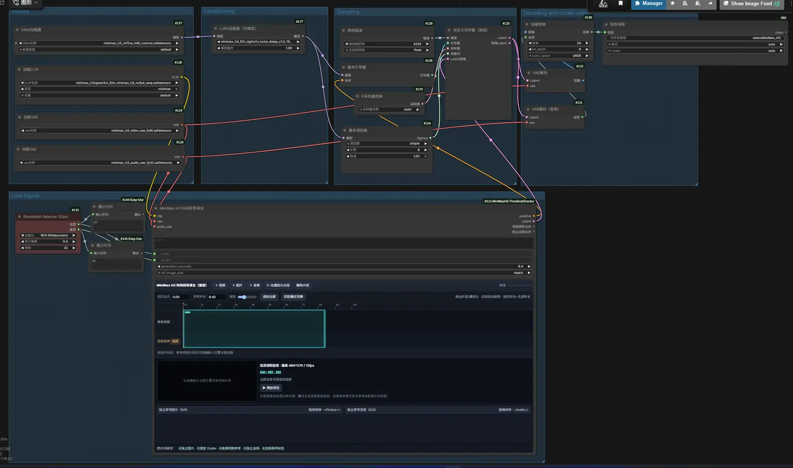
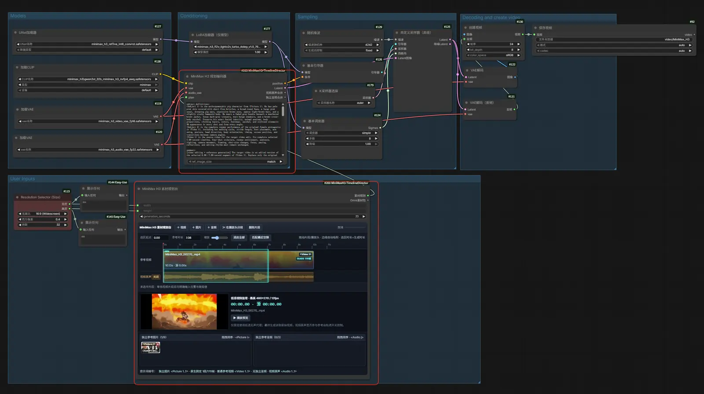
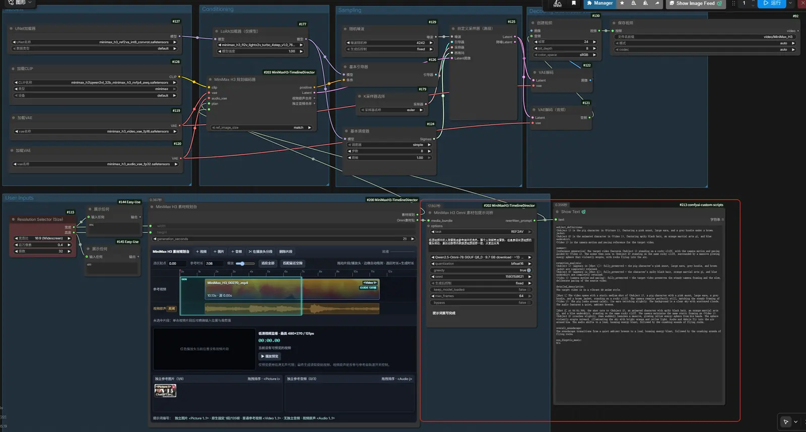
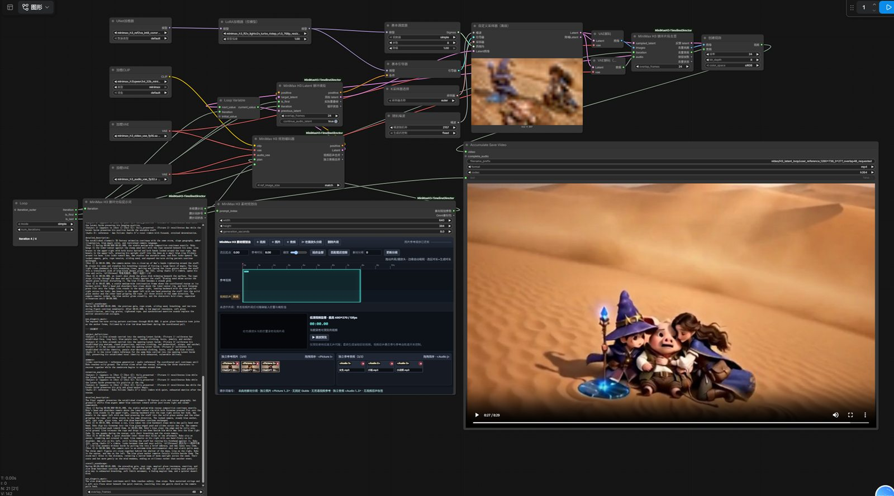

# ComfyUI MiniMax H3 时间线导演台

<p align="center">
  
</p>

<p align="center">
  作者：<strong>石兄松 / Shi Xiongsong</strong><br>
  <a href="https://space.bilibili.com/219572544?spm_id_from=333.40164.0.0">哔哩哔哩</a>
  ·
  <a href="https://www.youtube.com/@shixiongsong">YouTube</a>
</p>

简体中文 · [English](README.md)

> **实验分支测试版 `0.5.0.dev0`：** 本分支包含通用 Loop、直接 Latent 续段、按提示词序号分段选材等长视频实验功能。稳定正式版仍位于 `main`。

一个为 ComfyUI 原生 **MiniMax H3 Reference to Video** 工作流设计的可视化参考素材时间线。它将参考视频、视频原声、固定 Guide、独立图片和独立音频集中到一个类似剪辑软件的界面中。

> 视频生成 Agent 请阅读：[长视频分段生成 Agent 操作规范](docs/AGENT_LONG_VIDEO_GUIDE_CN.md)

## 主要功能

- 多视频时间线：移动、裁剪、分段、删除、吸附和精确数值定位。
- 青色生成选区：只有与选区重叠的素材区间参与本次视频参考或 Guide。
- 三种视频用途：`固定Guide`、`可编辑参考`、`仅固定边界`。
- 原声同步：视频移动和裁剪时原声保持绑定，也可关闭视频原声参考。
- 低清预览：最高 `480×270 / 12fps` 无声代理，红色播放头可拖动预览。
- 独立素材箱：图片和音频支持多选、外部拖入、删除及拖拽排序。
- 稳定编号：界面中的 `<Picture 1>`、`<Video 1>`、`<Audio 1>` 与 H3 输入顺序一致。
- 显存保护：素材在解码时按节点 `width × height` 调整分辨率。
- 音频输出：可分别输出时间线视频原声合并结果和独立参考音频合并结果。
- 状态保存：时间线编辑状态会写入 ComfyUI 工作流 JSON。

## 四个核心节点

| 节点 | 用途 |
| --- | --- |
| **MiniMax H3 素材规划台** | 编辑素材并输出紧凑的 `素材规划` 与 `Omni素材包`。 |
| **MiniMax H3 Omni 素材包提示词桥** | 将规划台素材送入已安装的 Prompt Rewriter Omni，并只输出 `rewritten_prompt`。 |
| **MiniMax H3 规划编码器** | 接收规划、提示词、CLIP 和 VAE，生成 H3 `positive` 与 `Latent`。 |
| **MiniMax H3 时间线导演台（兼容）** | 保留原先的一体化工作流和旧工作流兼容性。 |

拆分节点可以避免“素材输出连接到前置提示词重写器，再返回同一编码节点”产生的循环：

```text
素材规划台 ──Omni素材包──> Omni提示词桥 ──rewritten_prompt──> 规划编码器
     └────────────────素材规划──────────────────────────────> 规划编码器
```

## 安装

```bash
cd ComfyUI/custom_nodes
git clone https://github.com/Songssx/ComfyUI-MiniMaxH3-TimelineDirector.git
```

重启 ComfyUI 后，搜索 `MiniMax H3` 即可找到节点。

### 环境要求

- 较新的 ComfyUI，包含原生 MiniMax H3 节点及 `MiniMaxH3AddGuide`。
- MiniMax H3 Ref2VA 对应模型、CLIP、视频 VAE 和音频 VAE。
- Python 3.10 或更高版本。
- 低清代理依赖 ComfyUI 环境中的 `imageio-ffmpeg`。

插件不额外声明 pip 依赖，使用兼容 ComfyUI 通常已经包含的 PyAV、Pillow、NumPy、PyTorch、torchaudio、aiohttp 和 imageio-ffmpeg。

## 示例工作流

### 1. 基础时间线规划

使用兼容版 **MiniMax H3 时间线导演台**，适合直接编辑素材并完成 H3 编码。

[下载工作流](example_workflows/MiniMax_H3基础时间线规划工作流.json)



### 2. 时间线规划拆分节点

使用 **素材规划台 + 规划编码器**，适合需要解耦素材准备和 H3 编码的工作流。

[下载工作流](example_workflows/MiniMax_H3时间线规划拆分节点工作流.json)



### 3. 时间规划 + Prompt 提示词生成

在拆分节点基础上，通过 **MiniMax-H3 Prompt Rewriter Omni (sees and hears)** 读取同一份有序素材并扩写 H3 提示词。

[下载工作流](example_workflows/MiniMax_H3时间规划+Prompt提示词生成.json)



> 使用这个提示词生成工作流前，必须安装 [MiniMax-H3-Prompt-Rewriter-ComfyUI](https://github.com/pytraveler/MiniMax-H3-Prompt-Rewriter-ComfyUI)。模型、量化方式及显存要求请参考该项目说明。

### 4. Loop 循环长视频分段生成（实验）

该工作流使用 ComfyUI 通用 `Loop`，按循环序号选择本段提示词和素材；把上一段采样完成的 H3 视频/音频 Latent 尾部直接作为下一段 Guide，并在合并输出前删除重复的重叠画面和对应音频。素材规划台可为每一段分别安排参考图片与参考音频，每段编号均从 `<Picture 1>`、`<Audio 1>` 重新开始。

[下载长视频循环工作流](example_workflows/MiniMax时间线循环长视频分段生成工作流.json)

[循环分段提示词 Agent 规范](docs/MiniMax_H3_循环分段提示词_Agent规范.md)



> 当前工作流依赖 [ComfyUI 通用循环 PR #15923](https://github.com/Comfy-Org/ComfyUI/pull/15923) 对应的 Loop 节点实现，属于实验测试功能。运行前请核对分段数、每段帧数、FPS 与 `overlap_frames`。

## 基本使用方法

1. 设置 `width`、`height` 和 `generation_seconds`。
2. 用 `+ 视频`、`+ 图片`、`+ 音频` 添加素材；也可以把文件直接拖入控件。
3. 移动、裁剪或分段视频，并把青色选区放到本次需要生成的区间。
4. 为每段视频选择用途：
   - `固定Guide`：重叠部分按生成时间位置固定，适合续写和保持运动。
   - `可编辑参考`：只作为 `<Video N>` 参考，不硬锁原人物，适合人物或风格替换。
   - `仅固定边界`：仅固定重叠区首尾帧。
5. 按需开启或关闭“视频原声”参考。
6. 检查底部提示词编号，再连接对应编码或提示词工作流运行。

视频编号按照青色选区内重叠片段在时间线上的从左到右顺序生成。独立图片和独立音频按素材箱显示顺序生成编号，拖拽排序后会同步更新底层输入顺序。

## 长视频分段

推荐分段生成并保留短重叠区：下一段使用上一段末尾镜头作为开头 Guide，提示词中的 `Shot 1` 必须先描述这段重叠参考，再描述新内容。合并时删除后一段重复的固定 Guide 区域。完整规则见 [Agent 操作规范](docs/AGENT_LONG_VIDEO_GUIDE_CN.md)。

### 实验：直接 Latent 循环续写

插件另含三个实验节点，可配合 ComfyUI 的通用循环，把上一段采样完成的 H3 视频+音频 latent 尾部直接反馈到下一段，避开 `RGB Decode → VAE Encode` 往返：

- **MiniMax H3 循环分段提示词**：按 `iteration` 选择本轮提示词，并从第二轮起自动在 `[Shot 1]` 后补充固定重叠区说明。
- **MiniMax H3 Latent 循环续段**：第一轮原样通过；后续轮把上一轮 AV latent 尾部固定到本轮第 0 帧。
- **MiniMax H3 循环片段去重**：完整 latent 反馈给 `Loop Variable`，但从第二段成片中删除重复画面及等时长音频。

此功能当前依赖尚未合入正式版的 [ComfyUI 通用循环 PR #15923](https://github.com/Comfy-Org/ComfyUI/pull/15923)。连接方法和已验证参数见 [Latent 循环长视频说明](docs/LATENT_LOOP_LONG_VIDEO_CN.md)，Agent 写词必须遵循 [循环分段提示词 Agent 规范](docs/MiniMax_H3_循环分段提示词_Agent规范.md)。可复现实验位于 `tests/experiments/run_minimax_h3_latent_loop.py`。

## 致谢与参考

- 本项目的 Omni 提示词桥及提示词工作流参考并适配了 [pytraveler/MiniMax-H3-Prompt-Rewriter-ComfyUI](https://github.com/pytraveler/MiniMax-H3-Prompt-Rewriter-ComfyUI)。
- MiniMax H3 提示词结构与模型使用方式请参考 [MiniMax-AI/MiniMax-H3](https://github.com/MiniMax-AI/MiniMax-H3)。
- 感谢 ComfyUI 原生 MiniMax H3 与 Guide 节点的维护者。

## 许可

[GPL-3.0](LICENSE)
